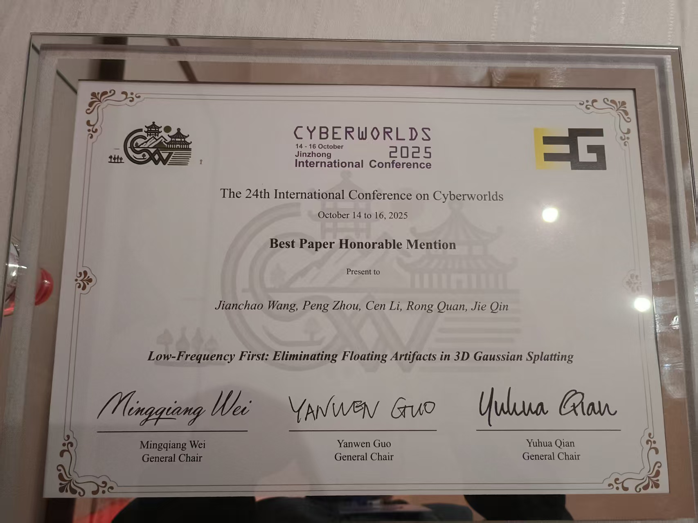
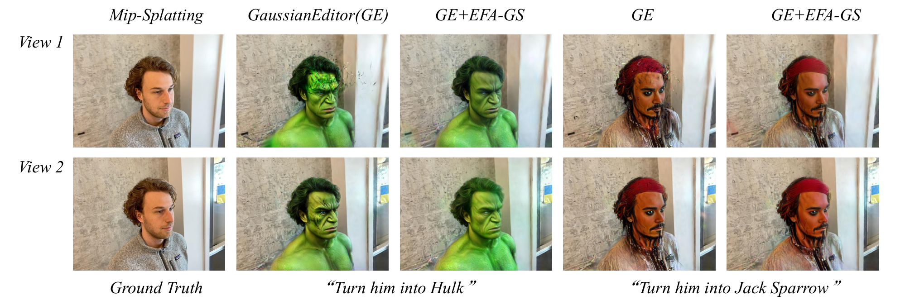

<div align="center">

  <h1 align="center">Low-Frequency First: Eliminating Floating Artifacts in 3D Gaussian Splatting</h1>

  <a href="https://arxiv.org/abs/2508.02493"></a>
  <a href="https://jcwang-gh.github.io/EFA-GS"></a>
  <a href="https://pan.baidu.com/s/1hkx_vI170OeMQMNW4WDZNA?pwd=fp83"></a>
</div>

<p align="center">
  <a href="">
    
  </a>
</p>

<p align="center">
  <a href="">
    
  </a>
</p>

<p align="center">
  <a href="">
    
  </a>
</p>

<p align="center">
We applied frequency analysis to identify the cause of floating artifacts in 3D Gaussian Splatting (3DGS) and designed a novel approach, <strong><em>Eliminating-Floating-Artifacts Gaussian Splatting</em></strong>  (EFA-GS), to address this issue effectively and efficiently. EFA-GS achieved good performance on multiple 3DGS-based reconstruction/generation tasks. 
</p>
<br>

# Update (2025.10.16)

Our paper has recieved the **Best Paper Honorable Mention** at the 24th International Conference on Cyberworlds (CW2025)!

# Update (2025.09.18)

We uploaded the RWLQ dataset and our SfM initializations of the TanksandTemples dataset to Baidu NetDisk. We also uploaded the scripts of training EFA-GS on RWLQ dataset.

# Update (2025.09.08)
Our work has been accepted by the 2025 International Conference on Cyberworlds (CW2025).

# TODO List
- [x] Datasets
- [x] Tolerance-based comparison

# Installation Guidance

We use anaconda to manage virtual enviroments, so make sure that you've installed anaconda (or miniconda) before installing this repository. The installation guidance is below:

1. Clone this repository;
2. For EFA-GS(3DGS), the installation commands are list below:
```Bash
cd 3DGS
conda create -y -n EFA-3DGS python=3.11
conda activate EFA-3DGS
conda install cudatoolkit-dev=11.7 -c conda-forge
pip install -r requirements.txt
```
3. For EFA-GS(Mip), the installation commands are listed below:
```Bash
cd Mip-splatting
conda create -y -n EFA-Mip python=3.11
conda activate EFA-Mip
conda install cudatoolkit-dev=11.7 -c conda-forge
pip install -r requirements.txt
```

# Datasets

We used 3 datasets to evaluate EFA-GS in the paper. They are:
1. *Real-World-Low-Quality* Dataset (*RWLQ*, not released yet);
2. [*Mip-NeRF 360* Dataset](https://jonbarron.info/mipnerf360/);
3. [*TanksandTemples* Dataset](https://www.tanksandtemples.org/download/).

We put these datasets in a directory `data`:
```Bash
data
|---RWLQ
|   |---astronaut
|   |---...
|---360v2
|   |---bicycle
|   |---...
|---TanksandTemples
|   |---advanced
|   |   |---Auditorium
|   |   |---...
|   |---intermediate
|   |   |---Family
|   |   |---...
|   |---trainingdata
|   |   |---Barn
|   |   |---...
```
We use colmap to [process](https://github.com/graphdeco-inria/gaussian-splatting?tab=readme-ov-file#processing-your-own-scenes) `RWLQ` and `TanksandTemples` in order to get SfM initializations.

Before training, we need to set up symbolic links:
```Bash
ln -s absolute/path/to/data ./3DGS/data
ln -s absolute/path/to/data ./Mip-Splatting/data
```
# Initialization Options

This implementation provides two initialization modes:

**Normal Initialization (default)**

    1. Uses the same settings as the original 3D Gaussian Splatting paper.

    2. Recommended for all standard use cases.

**Low-Quality Initialization**

    1. Intentionally generates floating artifacts for experimental comparison.

    2. Should only be used when reproducing the low-quality results in our paper.

    3. Not recommended for normal applications!

⚠️ **Important Note: Please use Normal Initialization unless you specifically need to reproduce our comparative low-quality results.**

To get Low-quality Initializations, you need to replace
```Python
# Normal Initialization
img_undist_cmd = (colmap_command + " image_undistorter \
    --image_path " + args.source_path + "/input \
    --input_path " + args.source_path + "/distorted/sparse/0 \
    --output_path " + args.source_path + "\
    --output_type COLMAP")
```
with
```Python
# Low-Quality Initialization
sparse_sub_dirs = os.listdir(args.source_path + "/distorted/sparse")
final_sparse_sub_dir = str(max([int(i) for i in sparse_sub_dirs]))
img_undist_cmd = (colmap_command + " image_undistorter \
    --image_path " + args.source_path + "/input \
    --input_path " + args.source_path + "/distorted/sparse/" + final_sparse_sub_dir + " \
    --output_path " + args.source_path + " \
    --output_type COLMAP")
```
in `convert.py`.

# Training & Evaluation

```Bash
# For EFA-GS(3DGS)
conda activate EFA-3DGS
cd absolute/path/to/EFA-GS/3DGS
# training and evaluation on Mip-NeRF 360 dataset
python scripts/run_mipnerf360.py
# training and evaluation on TanksandTemples dataset
python scripts/run_tat.py

# For EFA-GS(Mip)
conda activate EFA-Mip
cd absolute/path/to/EFA-GS/Mip-Splatting
# training and evaluation on Mip-NeRF 360 dataset
python scripts/run_mipnerf360.py
# training and evaluation on TanksandTemples dataset
python scripts/run_tat.py
```

# Hyperparameter Explanation

EFA-GS employs several hyperparameters that significantly influence training outcomes. However, a fixed set of hyperparameters cannot universally adapt to diverse scenarios or tasks. In our paper, maintaining consistent hyperparameters across multiple datasets serves primarily to demonstrate the inherent robustness of EFA-GS. For optimal performance in practical applications, careful tuning of these hyperparameters is essential.

Below, we provide a concise overview of these key hyperparameters and their roles in the training process.

```
init_scaling_multiplier_max: the maximum initial value of expanding factors in LFCF algorithm.
last_scaling_multiplier_max: the maximum value of expanding factors in LFCF algorithm at last.
init_scaling_multiplier_min: the minimum initial value of expanding factors in LFCF algorithm.
pow: to control the decay rate of expanding factors during training.
splitting_ub: upper bound of splitting probability thereshold. It is to reduce the number of splitting Gaussians during training.
splitting_lb: lower bound of splitting probability thereshold. It is to reduce the number of splitting Gaussians during training.
interval_times: It determines the interval between 2 adjacent LFCF operations. `interval_times=1` means that the original densification operation is totally replaced by LFCF operation during training.
diffscale: an indicator denoting whether to use the scale-based strategy.
```
# Impact of Hardware on Results

We find that different hardware devices can lead to variations in the reconstruction quality of EFA-GS. All experiments presented in the paper were conducted using 1 NVIDIA A100 GPU. To further investigate the influence of hardware on reconstruction performance, we additionally executed the implementation on 1 NVIDIA V100 GPU.

Here are the reconstruction results on Mip-NeRF360 dataset:

|               | A100  |      |       | V100  |      |       |
|---------------|-------|------|-------|-------|------|-------|
|               | PSNR  | SSIM | LPIPS | PSNR  | SSIM | LPIPS |
| Vanilla 3DGS  | 27.58 | 0.82 | 0.21  | 27.55 | 0.82 | 0.21  |
| EFA-GS(3DGS)  | 27.52 | 0.82 | 0.21  | 27.49 | 0.82 | 0.21  |
| Mip-Splatting | 27.92 | 0.84 | 0.18  | 27.89 | 0.84 | 0.18  |
| EFA-GS(Mip)   | 27.94 | 0.84 | 0.18  | 27.87 | 0.84 | 0.18  |

Here are the reconstruction results on TanksandTemples dataset:

|               | A100  |      |       | V100  |      |       |
|---------------|-------|------|-------|-------|------|-------|
|               | PSNR  | SSIM | LPIPS | PSNR  | SSIM | LPIPS |
| Vanilla 3DGS  | 21.51 | 0.79 | 0.28  | 21.50 | 0.79 | 0.28  |
| EFA-GS(3DGS)  | 21.69 | 0.80 | 0.28  | 21.67 | 0.80 | 0.28  |
| Mip-Splatting | 20.63 | 0.78 | 0.29  | 20.56 | 0.77 | 0.29  |
| EFA-GS(Mip)   | 21.31 | 0.79 | 0.28  | 21.25 | 0.79 | 0.28  |

ChatGPT gives us an explanation, which basically means the strict comparison in our code introduce numerical differences:

> Different GPU architectures (e.g., A100 vs. V100) can introduce slight numerical differences in floating-point computations due to factors like fused multiply-add implementation, Tensor Core behavior, and non-deterministic PyTorch operators. When gradient values are compared strictly (e.g., grad > prev_grad), even tiny variations (~1e-6) can lead to different execution paths and thus different results across devices.

After introducing a tolerance-based comparison (tolerance=1e-5), we successfully mitigate this issue. 

Here are the reconstruction results on Mip-NeRF360 dataset:

|               | V100  |      |       |
|---------------|-------|------|-------|
|               | PSNR  | SSIM | LPIPS |
| Vanilla 3DGS  | 27.55 | 0.82 | 0.21  |
| EFA-GS(3DGS, strict comparison)  | 27.49 | 0.82 | 0.21  |
| EFA-GS(3DGS, tolerance-based comparison)  | 27.50 | 0.82 | 0.21  |
| Mip-Splatting | 27.89 | 0.84 | 0.18  |
| EFA-GS(Mip, strict comparison)   | 27.87 | 0.84 | 0.18  |
| EFA-GS(Mip, tolerance-based comparison)   | 27.90 | 0.84 | 0.18  |

Here are the reconstruction results on TanksandTemples dataset:

|               | V100  |      |       |
|---------------|-------|------|-------|
|               | PSNR  | SSIM | LPIPS |
| Vanilla 3DGS  | 21.50 | 0.79 | 0.28  |
| EFA-GS(3DGS,strict comparison)  | 21.67 | 0.80 | 0.28  |
| EFA-GS(3DGS, tolerance-based comparison)  | 21.72 | 0.80 | 0.28  |
| Mip-Splatting | 20.56 | 0.77 | 0.29  |
| EFA-GS(Mip, strict comparison)   | 21.25 | 0.79 | 0.28  |
| EFA-GS(Mip, tolerance-based comparison)   | 21.32 | 0.79 | 0.28  |

# FAQ
***Q1.*** **Why are the reconstruction results on my datasets poor?**

***A1.*** Check whether Low-Quality Initialization is used or not. If Low-Quality Initialization is used, switch to Normal Initialization to get normal colmap results and give it another try.


# Acknowledgements

This project is built upon [3DGS](https://github.com/graphdeco-inria/gaussian-splatting) and [Mip-Splatting](https://github.com/autonomousvision/mip-splatting). Please follow the license of 3DGS. We thank all the authors for their great work and repos.

# Citation

If you find our work helpful, feel free to give us a star ⭐ or cite us using:

```
@misc{wang2025lowfrequencyfirsteliminatingfloating,
      title={Low-Frequency First: Eliminating Floating Artifacts in 3D Gaussian Splatting}, 
      author={Jianchao Wang and Peng Zhou and Cen Li and Rong Quan and Jie Qin},
      year={2025},
      eprint={2508.02493},
      archivePrefix={arXiv},
      primaryClass={cs.CV},
      url={https://arxiv.org/abs/2508.02493}, 
}
```
